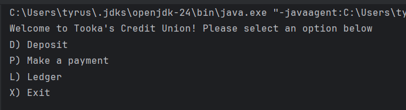
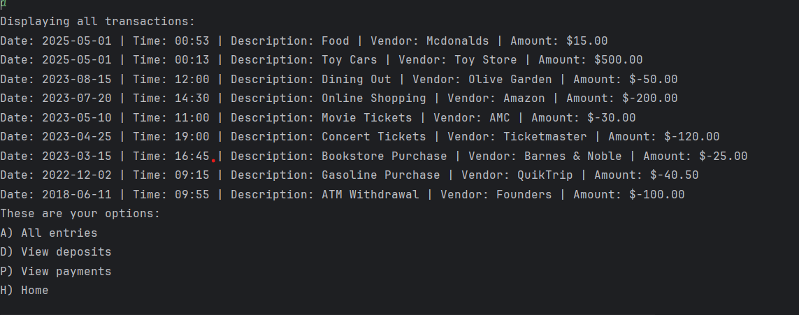
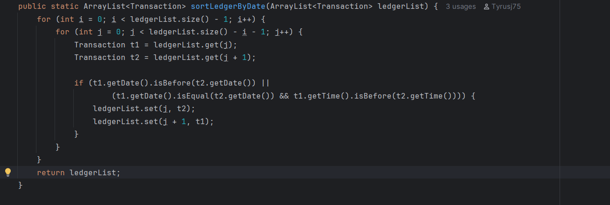

![HomeScreen]

![LedgerScreen]

This program provides users with a versatile set of features. It enables users to perform actions such as making deposits, processing payments, and reviewing their transaction history. Additionally, it allows users to access a comprehensive list of all their deposits and payments. The program also includes a reporting feature, where users can explore their transaction records by filtering them based on vendor names or specific date ranges. They can search transactions from the current month to the previous month, as well as from the current year to the previous year.

This method uses bubble sort to arrange Transaction objects in descending order by date and time. It swaps adjacent transactions if the earlier one comes before the later one.

