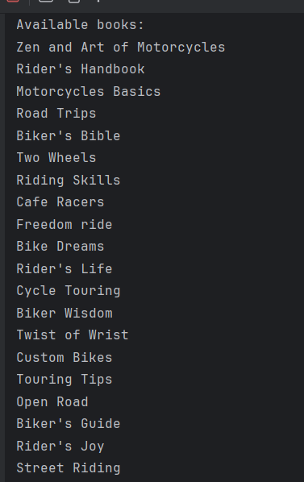
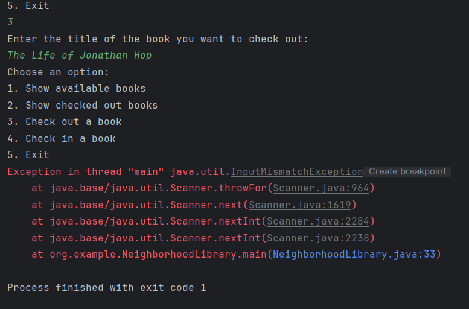

# Neighborhood Library

A simple Java application that simulates a neighborhood library system. Users can view available books, check out books, and return them.

## Features

- Display available books.
- Display checked-out books.
- Check out a book by title.
- Return a book by title.

Home Screen
[img.png](img.png)

Products Display Screen

Error Message

This program lets users check out and return books from a small library using the console.
One interesting part is the loop that adds all the books into the system automatically—it saves time and makes the code easier to manage.

