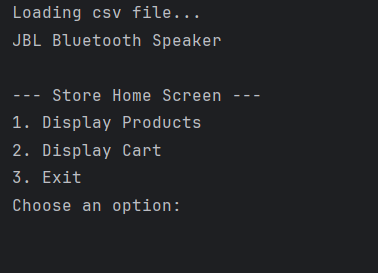
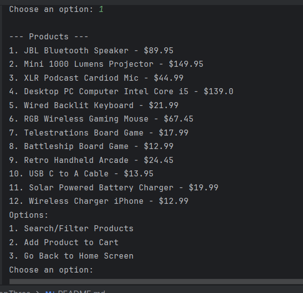
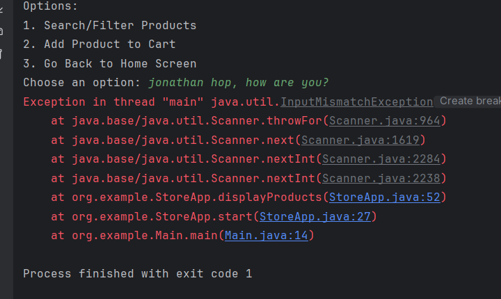

# Store Application

This is a simple Java-based store application that allows users to browse products, add them to a shopping cart, and check out. The application reads product data from a CSV file and provides a console-based interface for interaction.

## Features
- Display a list of products.
- Search and filter products.
- Add products to a shopping cart.
- View and manage the shopping cart.
- Check out and reset the cart.

## Screenshots

### Home Screen

### Products Display Screen

### Error Handling Example

